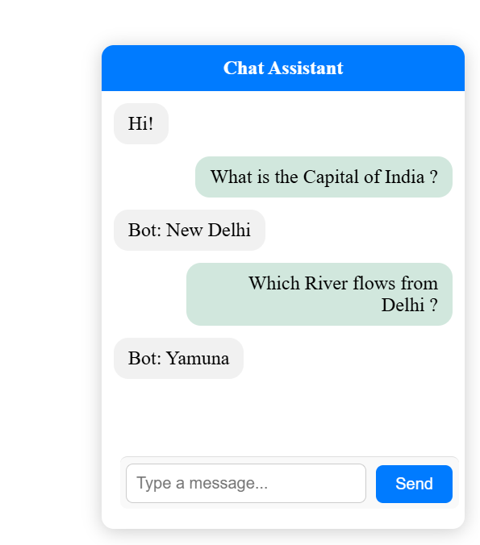

# Simple Chatbot with Conversation History

This is a simple web-based chatbot interface built using **HTML**, **CSS**, and **JavaScript**, which integrates the **Google Gemini API** to generate AI responses. 
The chatbot supports maintaining **previous conversation history** to provide more context-aware replies.

## ✨ Features

- Simple, responsive UI for chatting with the bot
- Integration with Google Gemini API
- Maintains conversation history for context-based responses
- Lightweight frontend-only implementation

## 🖼️ Screenshots

<!-- You can add screenshots here -->


## 🚀 Getting Started

### 1. Clone the Repository

```bash
git clone https://github.com/pandeyankit89/Chatbot_Basics.git
cd Chatbot_Basics
```
### 2. Create you API in Google AI Studio and update the API_KEY in file `Chatbot_JS.js`
---
